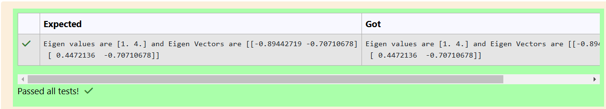

# EIGENVALUES-AND-EIGENVECTORS
## Aim:
To write a python program to find the Eigenvalues and Eigen Vectors
## Equipment’s required:
1. 	Hardware – PCs
2. 	Anaconda – Python 3.7 Installation / Moodle-Code Runner
## Algorithm:
### Step1 : 
### Step 2: 
### Step 3: Using the np.linalg.eig(),  we get two results (first is eigenvalue and second is eigenvector) of the given matrix.
### Step 4: 

## Program:
import numpy as np

matrix = np.array([
    [2, 2],
    [1, 3]
])

eigenvalues, eigenvectors = np.linalg.eig(matrix)
print(f"Eigen values are {eigenvalues} and Eigen Vectors are {eigenvectors}")
## Output:
Eigen values are [1. 4.] and Eigen Vectors are [[-0.89442719 -0.70710678]
 [ 0.4472136  -0.70710678]]
## Result:

Thus the Eigenvalue and Eigenvector is successfully solved using python program
